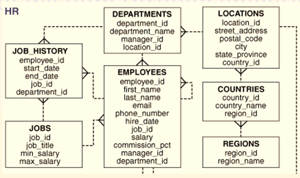

# CONTENEDOR CON MYSQL

Descargar y ejecutar: ``docker compose up``

y como no tienes un Dockerfile en el mismo directorio de mysql, Docker descargará automáticamente la imagen mysql:8.0 desde Docker Hub

Las variables las coge del .env 

Acceder a al contenedor con mysql

- ``docker ps`` para comprobar que está ok y sacar el name
- ``docker exec -it <name> bash``
- ``mysql -u root -p``
- rootpassword (no aparece)

## Mas info del docker compose

Con healthcheck en el docker compose podemos verficar el estado. 

Pueder tener un 'depend on' un servicio dependa de otro

En docker compose podemos especificar dónde queremos que guarde los archivos del volumen. Por defecto se guardan en una máquina virtual interna y es dificil de acceder. Podrías descomentar y personalizar la linea 11 del compose y comentar la 9 para decidir dónde se guarda el volumen

# TRABAJAR CON EL CONTENEDOR  DE MYSQL

> mysql

Podemos comprobar que el la linea 10 del compose ha ejecutado el archivo sql y ya tenemos la base de datos con la estructura y los datos en el contenedor. Para ello ejecutamos

- ``SHOW DATABASES;``
- ``USE hr;``
- ``SHOW TABLES;``

Con los datos cargados en el docker realiza las siguientes consultas

- Consultar los empleados del departamento de ventas que no tienen comisión.
- Consultar los empleados que ingresaron a laborar el primer trimestre del año 1981.
- Consultar los empleados cuyo ingreso (salario + comisión) supera los 2500.
- Consultar los empleados cuya penúltima letra de su nombre es E.
-  Consultar los empleado que la segunda letra de su nombre puede ser A, O u I.
- Se necesita saber cuánto es la planilla por cada departamento.
- Se necesita saber quiénes son los empleados que tienen el salario más alto por departamento.
- Se necesita saber el salario máximo, mínimo y el salario promedio por departamento.

Esta es la estructura de los datos

## Verificar múltiples conexiones

``SELECT * FROM information_schema.PROCESSLIST;``

# Recursos adicionales

Curso gratuito de mysql de Oracle: https://mylearn.oracle.com/ou/learning-path/mysql-getting-started/54552

Web para practicar: https://www.sql-easy.com/

Teoría y ejercicios: https://sqlbolt.com/

Super juego para aprender mysql: https://mystery.knightlab.com/

Para pruebas: https://www.db4free.net/ | https://www.clever-cloud.com/ | https://www.elephantsql.com/

